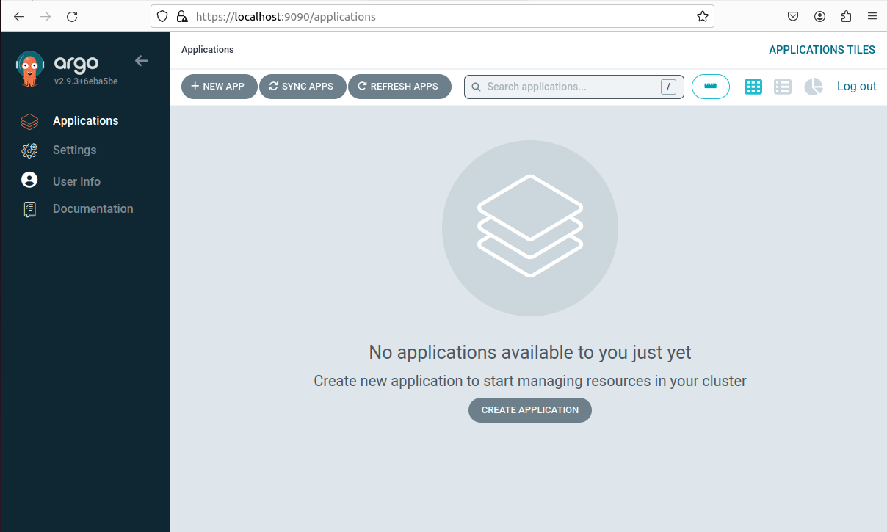
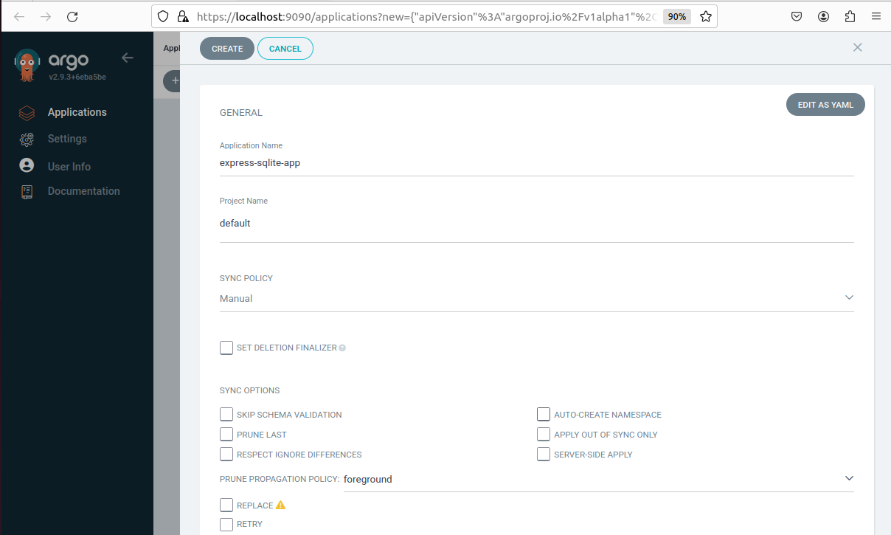
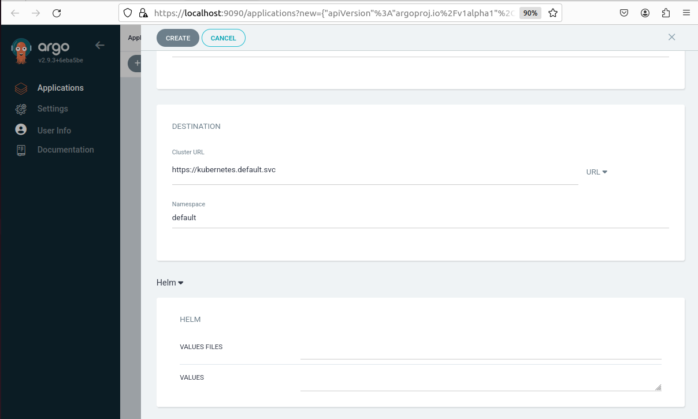
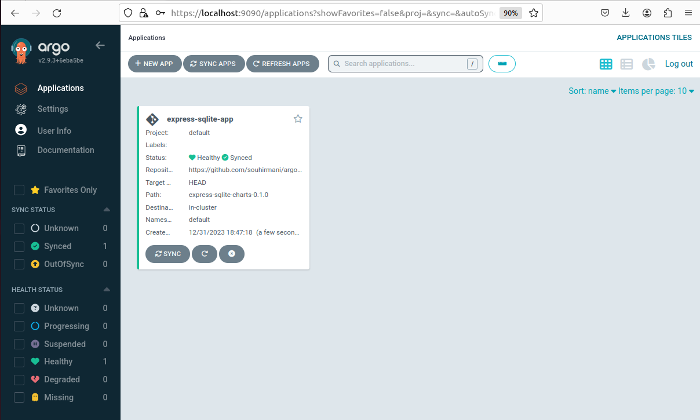
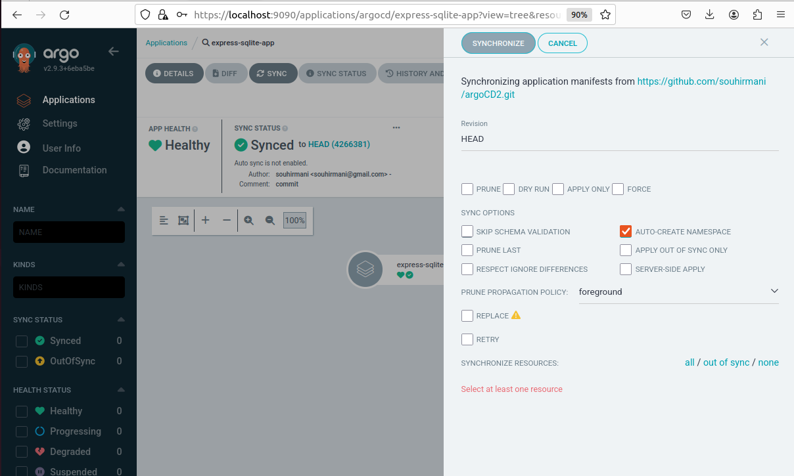

# argoCD2
voici l'interface de argoCD . J'ai créer l'application et lancée le deploiment avec les modifications :

les captures d'écran lors de creation de l'application

l'application créer:

et la synchronisation de l'application :

